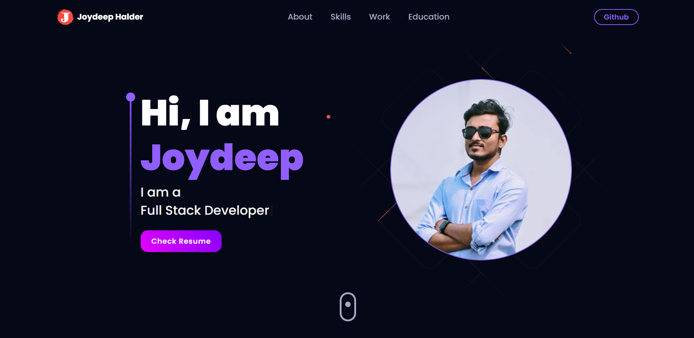

# Joydeep Halder's Portfolio

&nbsp;&nbsp;&nbsp;&nbsp;&nbsp;&nbsp;&nbsp;&nbsp;&nbsp;&nbsp;&nbsp;&nbsp;&nbsp;&nbsp;&nbsp;&nbsp;&nbsp;&nbsp;



Welcome to my personal portfolio repository! This project showcases my software development skills and various projects I've worked on.

## Table of Contents

- [Technologies Used](#technologies-used)
- [Installation](#installation)
- [Features](#features)
- [Contact](#contact)
- [License](#license)

## Technologies Used

- [Next.js](https://nextjs.org/) - A React framework for building server-rendered applications.
- [React](https://reactjs.org/) - A JavaScript library for building user interfaces.
- [Tailwind CSS](https://tailwindcss.com/) - A utility-first CSS framework for rapidly building custom designs.
- [Three.js](https://threejs.org/) - A JavaScript library for 3D graphics.
- [TypeScript](https://www.typescriptlang.org/) - A superset of JavaScript that adds static types to the language.
- [React Hook Form](https://react-hook-form.com/) - A library for managing form state and validation in React.
- [Zod](https://github.com/colinhacks/zod) - A TypeScript-first schema declaration and validation library.
- [Framer Motion](https://www.framer.com/motion/) - A production-ready motion library for React.

## Installation

1. Clone this repository to your local machine:

```
git clone https://github.com/halderjoydeep/portfolio.git
```

2. Navigate to the project directory:

```
cd portfolio
```

3. Install dependencies:

```
npm install
```

## Usage

1. Start the development server:

```
npm run dev
```

## Features

- **Server Side Rendering:** Utilizing Next.js powerful app router that gives server side rendering and many more optimizations.
- **Interactive 3D Projects:** Utilizing Three.js, I've created interactive 3D projects to showcase my skills.
- **Form Handling:** The contact form is powered by React Hook Form and Zod for validation.
- **Smooth Animations:** Framer Motion is used for smooth and engaging animations throughout the portfolio.

## Contact

Feel free to reach out to me at [halderjoydeep1997@gmail.com](halderjoydeep1997@gmail.com) for collaborations, questions, or opportunities.

## License

This project is licensed under the [MIT License](LICENSE) - see the [LICENSE](LICENSE) file for details.
